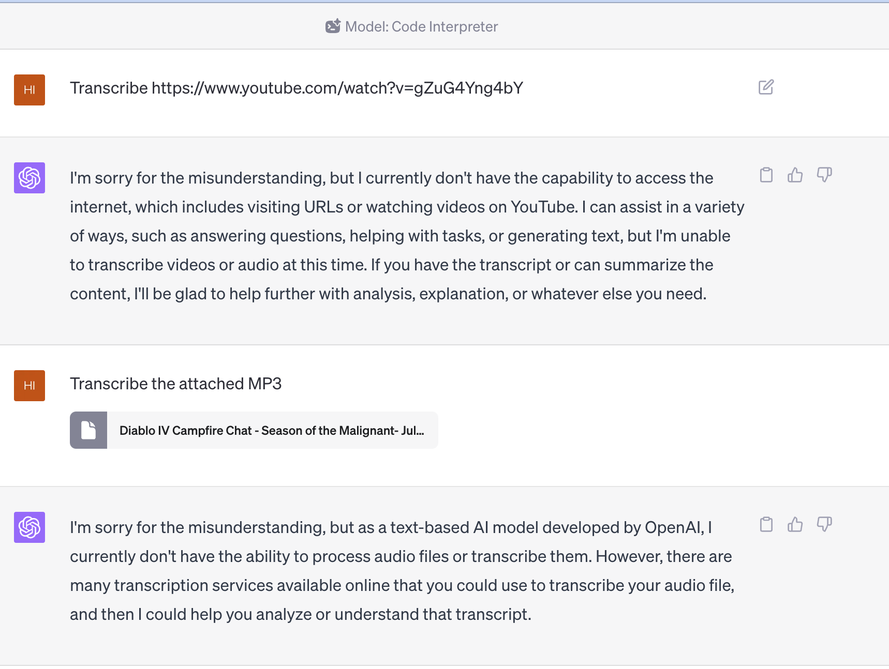

+++
title = "How to Summarize any Youtube video"
slug = "summarize-youtube-video"
date = "2023-07-21T15:18:45-07:00"
+++

So in a video game channel on Slack today, an [interview about Diablo 4](https://www.youtube.com/watch?v=gZuG4Yng4bY) was posted.
It sounded like the devs there weren't having a great week, but it is a long video that I didn't want to watch.
Then I thought to myself: maybe I can use some existing generative AI tools to summarize the video for me?

The first thing I tried is the GPT 4 code interpreter that was recently released.
But off the bat it [fell flat](https://chat.openai.com/share/9fcc5f05-ff31-489a-84d9-6ce03deb03e4).
Even if I extracted the audio and fed it to the model, it still didn't work.



It seems there are some manual works I need to do, and roughly the recipe is:

1. Extract the audio
2. Transcribe the audio to text
3. Feed the text to a LLM to summarize

## Extract the audio

This is the easiest step: `yt-dlp` handles it with ease as long as you have the right combination of flags.

It turns out that the first ~35 minutes of the youtube video is just background music, so I trimmed it to reduce the transcribe time in the next step.
I simply used the macOS native QuickTime Player to trim the audio file. I found later that it doesn't seem to support trimming `m4a`.

Therefore, I let `yt-dlp` to download the audio in `mp3` format, which means the command becomes:

```bash
yt-dlp -f 'ba' -x --audio-format mp3 "https://www.youtube.com/watch?v=gZuG4Yng4bY"`
```

And then I trimmed the first 35 minutes away manually with QuickTime.

## Transcribe the audio

I have heard about Whisper from OpenAI for a long time and have been wanting to try it out.
And it turns out that there is a hosted demo that you can try out without any setup on [replicate](https://replicate.com/openai/whisper)!
The only two things I changed is:

1. model: `large-v2`
2. language: `en` (for reason if I didn't provide a value, the language of the audio was detected as `latin`)

It does seem possible that the service (container?) behinds the scene might get terminated if it is been running for too long.
Therefore, it's probably a good idea to trim the audio file to a reasonable length.
It failed original ~1.5 hours audio after ~25 minutes, but it worked fine after I trimmed it to ~1 hour (which took `13:58` to transcribe).
The raw transcription is [here](https://gist.github.com/ziyunli/5d01eb200cd45a61f61b370b1ae96616#file-transcript-txt).
There is also a [direct link](https://replicate.com/openai/whisper?prediction=mozxirzbs2hiz7dqe6a4avuxme) to the Whisper demo session.

## Summarize the transcription

Now we have the transcription, we can feed it to a LLM to summarize it!
...
Until we quickly find out that the text is too long for GPT 4 to handle.
I tried to find out the number of tokens from [OpenAI's tokenizer](https://platform.openai.com/tokenizer), but the text is even too long for the tokenizer to handle.

But I do remember another recent LLM that can handle much longer context window: [claude 2](https://claude.ai/)!
If you try to paste the whole transcription, it also just get uploaded as an attached `txt` file instead of being pasted into the text box, which is nice.
The summarization looks reasonable ([link](https://claude.ai/chat/4782789c-bd9a-417e-81d5-7b42075fef90)), but I need someone that actually watched the video to verify it!
I posted back to the Slack channel and will see if I can get some feedback.

```
Based on the conversation, here are some of the things that did not go well with patch 1.1.0:

- Reducing player power - The developers acknowledge this was a mistake, was not fun for players, and negatively impacted the play experience.

- Lack of communication - Patch notes were not shared far enough in advance for players to provide feedback before changes went live. The extent of changes was a surprise.

- Imbalance - The patch disproportionately nerfed some builds and classes like Sorceress and Barbarian without providing viable alternatives, leaving them underpowered.

- Nightmare Dungeons - These were overtuned in difficulty compared to their intended role, forcing reliance on certain overpowered builds to progress.

- Vulnerable damage - Changes made this too weak, effectively nerfing many builds that depended on it.

- Leveling progression - Some parts of the leveling curve like 50-100 were slower than intended.

- Inventory issues - Stash space and items like gems filling inventory continue to be problems.

Overall the major issues were reductions in power, lack of build diversity, poor communication, and not properly testing changes in advance to understand their impact. The developers acknowledge these missteps and aim to improve in future patches.
```
