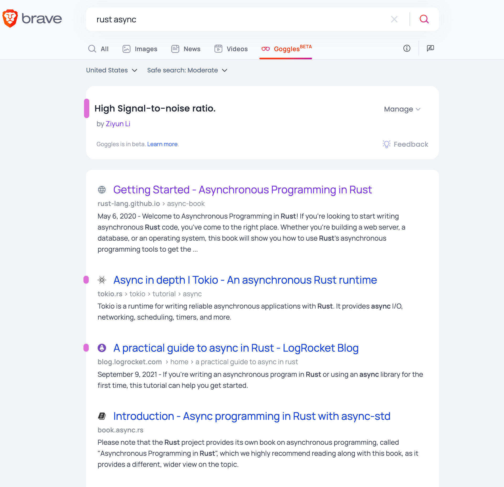

Goggles allow you to alter the ranking of Brave search by using rules and filters[^1].

You need to create a plain text file and host it on either GitHub or GitLab. Brave only keeps a reference of the original Goggle file when provided with a link to the original source. If you make it public, it becomes searchable[^2].

I quickly created my [own](https://github.com/ziyunli/goggles/blob/main/snr.goggle) in  <5 mins, and it works like a charm 🥳

[^1]: https://github.com/brave/goggles-quickstart/blob/main/getting-started.md#getting-started "Googles Getting Started"
[^2]: https://search.brave.com/goggles/discover "Discover Goggles"
