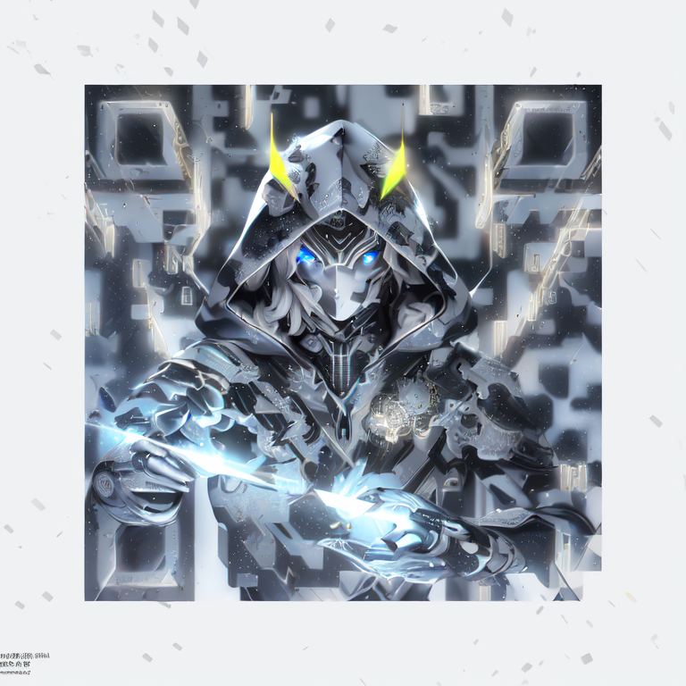
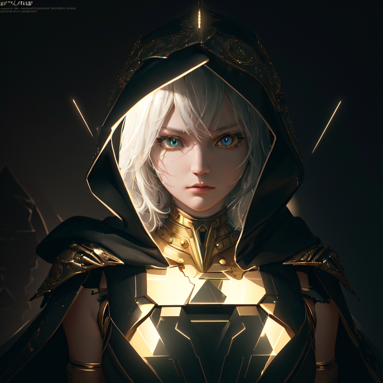

+++
title = "Lab Notes: Automatic1111"
date = "2023-06-14T18:03:16-07:00"

tags = ["lab notes", "stable diffusion"]
+++

I have been sleeping on stable diffusion for a while, but the recent [ControlNet for QR Code](https://www.reddit.com/r/StableDiffusion/comments/141hg9x/controlnet_for_qr_code/) sparked my interest again. So as always, I am late to the party. But I guess it is better late than never.
There is already a comprehensive [step-by-step tutorial](https://stable-diffusion-art.com/qr-code/) on the QR code generation, so I decided to follow it on my first attempt.

<!--more-->

The first step is to get [stable-diffusion-webui](https://github.com/AUTOMATIC1111/stable-diffusion-webui) running.
One tiny thing that I didn't know before I started is that people in the community just call it Automatic1111, or even A1111.
Knowing this helps a bit when you are googling.
The same website has a [tutorial](https://stable-diffusion-art.com/install-mac/) for Mac installation, but it makes things sound much harder than it actually is.
You pretty much just clone the repo, download models and/or checkpoints to `models/` and run `./webui.sh` and you are good to go.
The first time took a while because it needs to download the dependencies and models.
I also noticed `Warning: caught exception 'Torch not compiled with CUDA enabled', memory monitor disabled` in the log, which seems like it's only using CPU.

The next step is to install the [ControlNet extension](https://github.com/Mikubill/sd-webui-controlnet), which also has its own [tutorial](https://stable-diffusion-art.com/controlnet/).
The installation itself is so straightforward, as described in the [Readme](https://github.com/Mikubill/sd-webui-controlnet#installation), that I didn't bother to read the tutorial.
This turns out to be a noob mistake. The tutorial talks about the concept and the different models, which would have saved me a lot of time later.

Finally we have everything ready for the QR code generation. The requirements for the QR code are quite interesting:

> - Use a high fault tolerance setting (30%).
> - Have a white margin around the QR Code (the quiet zone).
> - Use the most basic square fill with a black-and-white pattern.
> - Avoid using generators that introduce a thin white line between black elements.

From [another article](https://arstechnica.com/information-technology/2023/06/redditor-creates-working-anime-qr-codes-using-stable-diffusion/), it seems to leverage the innate error correction feature so that the QR code can be distorted to fit the generated image while still being readable.
However, even with a high fault tolerance setting, the generated QR code is still a hit or miss.

And here comes my second noob mistake...I totally didn't keep track of the parameters for each generation! Fortunately, A1111 has me covered: there is "PNG Info" tab that can read the parameters from the generated image. Interestingly, I can't figure out how to read this information in the macOS native preview app, so I wonder the data is stored in the PNG file in a slightly special way.

Now for example, compared these two images that are generated with the same prompt and seed.
The first one is (borderline) readable.

> ((masterpiece),(best quality),(ultra-detailed), (upper body:1.2), 1male, solo, hood up, cyborg mask, glowing eyes, facing camera, neon details, male focus, cloak, spaceship, lightning, ultra realistic details, portrait, global illumination, shadows, octane render, 8k, ultra sharp,intricate, ornaments detailed, cold colors, metal, egypician detail, highly intricate details, realistic light, trending on cgsociety, time travel, break mirror
>
> Negative prompt: ugly, disfigured, low quality, blurry, nsfw
>
> Steps: 50, Sampler: DPM++ 2M Karras, CFG scale: 7, Seed: 3502696068, Size: 768x768, Model hash: e3edb8a26f, Model: ghostmix_v20Bakedvae, Denoising strength: 0.75, ControlNet: "preprocessor: tile_resample, model: control_v11f1e_sd15_tile [a371b31b], weight: 1, starting/ending: (0.23, 0.7), resize mode: Crop and Resize, pixel perfect: False, control mode: Balanced, preprocessor params: (-1, 1, -1)", Version: v1.3.2

But the second one is not.

> ((masterpiece),(best quality),(ultra-detailed), (upper body:1.2), 1male, solo, hood up, cyborg mask, glowing eyes, facing camera, neon details, male focus, cloak, spaceship, lightning, ultra realistic details, portrait, global illumination, shadows, octane render, 8k, ultra sharp,intricate, ornaments detailed, cold colors, metal, egypician detail, highly intricate details, realistic light, trending on cgsociety, time travel, break mirror
>
> Negative prompt: ugly, disfigured, low quality, blurry, nsfw
>
> Steps: 50, Sampler: DPM++ 2M Karras, CFG scale: 7, Seed: 3502696068, Size: 768x768, Model hash: e3edb8a26f, Model: ghostmix_v20Bakedvae, Denoising strength: 0.75, ControlNet: "preprocessor: tile_resample, model: control_v11f1e_sd15_tile [a371b31b], weight: 1, starting/ending: (0.24, 0.8), resize mode: Crop and Resize, pixel perfect: False, control mode: Balanced, preprocessor params: (-1, 1, -1)", Version: v1.3.2

The only difference here is the "Ending Control Step", from 0.7 to 0.8.
As in the document said: "Decrease to stop the ControlNet earlier so that the QR code and the image can blend more naturally."
You can see that in the second QR code, the character is less distorted, but the QR code is not readable anymore.

I think the same seed also generates relatively similar images. For example, below is generated with the same seed but different prompt and input.
You can definitely relate to the previous two images in terms of the overall style.

> light, futobot, cyborg, ((masterpiece),(best quality),(ultra-detailed), (upper body:1.2), 1male, solo, hood up, upper body, mask, facing camera, male focus, cloak, spaceship, lightning, ultra realistic details, portrait, global illumination, shadows, octane render, 8k, ultra sharp,intricate, ornaments detailed, cold colors, metal, egypician detail, highly intricate details, realistic light, trending on cgsociety, neon details, time travel, broken mirror

> Negative prompt: ugly, disfigured, low quality, blurry

> Steps: 50, Sampler: DPM++ 2M Karras, CFG scale: 7, Seed: 3502696068, Size: 768x768, Model hash: e3edb8a26f, Model: ghostmix_v20Bakedvae, Denoising strength: 0.75, ControlNet: "preprocessor: depth_leres++, model: control_v11f1p_sd15_depth [cfd03158], weight: 1, starting/ending: (0, 1), resize mode: Crop and Resize, pixel perfect: False, control mode: ControlNet is more important, preprocessor params: (512, 0, 0)", Version: v1.3.2

Therefore, my workflow right now is
1. Cherry pick some keywords from some example prompts
2. Keep hitting generate to roll the dice with -1 seed
3. Once I see one somewhat close to the vibe I am looking for, I will fix the seed and  tweak the prompt and parameters.

Given that basically I am throwing things at the wall and see what sticks, the generation speed is very important.
Unfortunately, with M1 it's quite slow: it takes me ~3 minutes to generate one image.
I generated ~40 images in total last night. It was a pretty boring two-hour period that I actually had to start this post...

I do have a PC with a dedicated GPU sitting around, even though it's a mere 1660.
That's gonna be my next thing to test before I opt for more powerful options (in which case Google Colab and Paperspace would be my first choices).

By the way, I got quite lucky with my fifth image and I am quite happy with how it looks.
This will be my QR code for me advertising this blog for a while.

