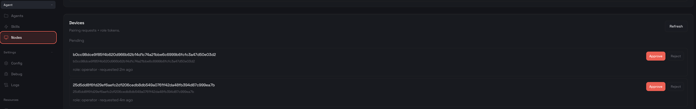

OpenClaw(aka Moltbot, aka ClawdBot) has been the hottest topic for a couple of weeks, and therefore over the last weekend I found some time to try it out.

My first try was actually on a  brand new VPS instance. It sorta worked except that the 1 vCPU + 2G instance just couldn't handle many things such as installing/building Claude Code, adding MCP servers...After running into pegging 100% CPU usage, OOM, out-of-swap space, SSH connection timed out, I decided to take another look at my Mac Mini.

That being said, given the wide attack surface OpenClaw exposes, I absolutely do not want to install it without any isolation. Remembering a [post by Emil Burzo](https://blog.emilburzo.com/2026/01/running-claude-code-dangerously-safely) I read, I decided to go with Vagrant that provides enough isolation with a VM, easy to back up and re-provision, and easy to share folders with the host. 

At the end of the weekend, this is the [Vagrantfile](https://github.com/ziyunli/ClawdBox) that I am happy with - a Ubuntu VM with Node LTS and five popular coding agents (Claude Code, Codex, Gemini, Amp, and Pi)  for LLM experiments. And it's ready for OpenClaw. I also want to have Tailscale running in the VM, so that I can easily connect from my other devices in the same VPN. You need to generate a [Tailscale auth key](https://tailscale.com/kb/1085/auth-keys), and also in the [DNS page](https://login.tailscale.com/admin/dns), in "Global nameservers", enable "Override DNS servers", and add a Global DNS such as `1.1.1.1` (Cloudflare Public DNS). 

And now you can start the OpenClaw setup. 

First, `vagrant up && vagrant ssh`. 

Once you are in the VM, 

```sh
# Install Homebrew
curl -fsSL https://raw.githubusercontent.com/Homebrew/install/HEAD/install.sh

# Install and configure OpenClaw
curl -fsSL https://openclaw.ai/install.sh | bash
```

After installing OpenClaw, it will kick off the [guided setup](https://docs.openclaw.ai/start/wizard) (which you can always re-enter by `openclaw onboard`). Make the following choice:
- Onboarding mode: 
	- Manual
- What do you want to set up?
	- Local gateway (this machine)
- Workspace directory: 
	- `/home/vagrant/.openclaw/workspace` (default - we share this workspace between VM and the host)
- Model/auth provider: 
	- I use OpenAI Codex. After authentication, you will see a "This site can’t be reached" page. This is expected, just copy the URL of the page and paste into OpenClaw TUI. And wait a bit for OpenClaw to set it up. 
- Gateway port: 
	- 18789 (if you change it, you also need to change the Vagrantfile)
- Gateway bind: 
	- Loopback (127.0.0.1)
- Tailscale exposure: 
	- Serve
- Reset Tailscale serve/funnel on exit?: 
	- No
- Configure chat channels now?
	- I found Telegram is the easiest to set up - chat to [BotFather](https://t.me/BotFather), create a new bot and get a token, and paste it into the set up. 
	- After the onboarding, in Telegram you send a message to a bot, then you will see a command like `openclaw pairing approve telegram <CODE>` that you can run in the VM. 
- Install Gateway service: 
	- Yes
- Gateway service runtime
	- Node (recommended)

At this point your OpenClaw is up and running, and you can see via `openclaw status`.

Then you can run `openclaw dashboard --no-open`, and you will see the `Dashboard URL: http://127.0.0.1:18789/?token=<...>`. Although your gateway is local, which means it's a localhost-only service within the VM, but because in our Vagrantfile we have this line:

```ruby
config.ssh.extra_args = ["-L", "18789:127.0.0.1:18789"]
```

So while `vagrant ssh` session is open, you can visit the Dashboard from your host browser. This is very important for our next step to pair other devices in the same Tailscale VPN. 

In the `openclaw status` overview, you should see `Tailscale` with value `https://<machine-name>.tail<...>.ts.net`. Try to visit that from a browser in another Tailscale device. It should bring you to the dashboard, but with an error "disconnected (1008): pairing required". Now you go back to the dashboard of your VM host's browser, you should see under "Agents -> Nodes" page, within the "Devices"  section, there should be a pending pairing request. Once you approve, your other Tailscale device can connect to the dashboard too. 


